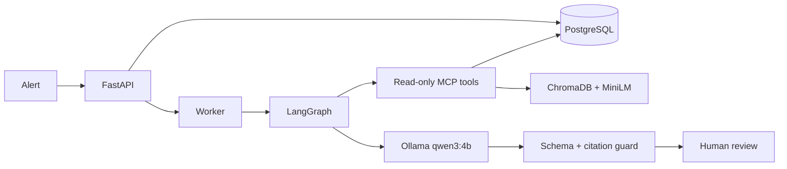

# AI SRE Copilot

An evidence-grounded, local-first incident diagnosis platform that correlates structured logs, Kafka state, deployment history, runbooks, and historical RCAs before proposing a human-reviewed remediation.

[Open the permanent recruiter demo](https://jyothsna-jgoru.github.io/AI-SRE-Copilot/) · [Architecture](docs/architecture.md) · [Evaluation methodology](docs/evaluation.md) · [Demo script](docs/demo-script.md)

> The public demo replays clearly labeled outputs from the local Ollama workflow. The genuine end-to-end stack runs locally with Docker Compose and uses no paid API.

## What the project demonstrates

- A stateful LangGraph investigation workflow—not a single chatbot prompt
- Six allowlisted, read-only MCP investigation tools
- Local inference through Ollama and `qwen3:4b`
- MiniLM embeddings and ChromaDB retrieval with service metadata filters
- Kafka alert events and consumer-lag evidence
- PostgreSQL persistence for incidents, traces, reports, and human review
- Pydantic structured output, evidence-citation validation, and no-action safeguards
- A 50-incident golden set whose expected answers are isolated from the agent
- FastAPI, Streamlit, Docker Compose, Pytest, Locust, and GitHub Actions

## System flow



## Zero-cost deployment strategy

The full system needs resources that a stable free hosted tier does not reliably provide: PostgreSQL, Kafka, ChromaDB, a worker, and CPU-based model inference. This repository therefore uses two honest modes:

1. **Local live mode:** the real stack runs in Docker and performs live Ollama inference.
2. **Public portfolio mode:** GitHub Pages provides a permanent clickable demonstration using recorded local outputs. It never claims the browser is running the model.

No credit card, API key, paid domain, or cloud VM is required.

## Quick start

Prerequisites: Docker Desktop with at least 12 GB memory available, Git, and approximately 10 GB free disk space.

```bash
git clone https://github.com/Jyothsna-jgoru/AI-SRE-Copilot.git
cd AI-SRE-Copilot
copy .env.example .env  # Windows; use cp on macOS/Linux
docker compose up --build
```

The first start downloads `qwen3:4b`, so it takes longer. Then open:

- Dashboard: http://localhost:8501
- API documentation: http://localhost:8000/docs
- API health: http://localhost:8000/health

Local demonstration accounts:

| Role | Email | Password | Capability |
|---|---|---|---|
| Viewer | `viewer@local.dev` | `viewer123` | Read incidents and reports |
| Analyst | `analyst@local.dev` | `analyst123` | Request diagnoses |
| Commander | `commander@local.dev` | `commander123` | Approve/reject recommendations |

These credentials are synthetic and must not be reused in any real environment.

## Investigation tools

| MCP tool | Evidence returned |
|---|---|
| `search_logs` | Error/warning logs, timestamps, and trace IDs |
| `get_kafka_status` | Topic records and persisted consumer-lag snapshots |
| `check_deployment` | Releases within the incident window |
| `retrieve_runbook` | ChromaDB/MiniLM operational knowledge |
| `find_similar_incidents` | Historical RCA evidence |
| `get_service_health` | Error rate, latency, and availability |

There is intentionally no shell, rollback, deploy, restart, or write tool.

## Synthetic environment

- Five services: API gateway, order, payment, inventory, and notification
- 50 deterministic incidents across five scenario families
- 1,100 structured logs
- 300 persisted Kafka records/lag snapshots
- Deployment history for every incident
- 15 grounding documents: runbooks, service documentation, and historical RCAs

The hidden `evaluation_cases` table is not reachable through the incident API or MCP server.

## Development

Use Python 3.11 for local non-Docker development.

```bash
python -m venv .venv
.venv\Scripts\activate
pip install -r requirements-dev.txt
pytest
ruff check .
```

Load testing after the stack is running:

```bash
locust -f tests/locustfile.py --host http://localhost:8000
```

## Safety and limitations

- All investigation tools are read-only.
- Every RCA must cite retrieved evidence IDs.
- Unsupported citations cause the workflow to fail closed.
- Every recommendation requires human review.
- Approval records a decision but performs no infrastructure action.
- The dataset is synthetic; this is a portfolio/reference implementation, not production incident automation.
- Accuracy and latency numbers are published only after a complete local evaluation run.

## Author

Built by **Jyothsna Goru** as a portfolio project demonstrating AI engineering, backend development, platform thinking, evaluation discipline, and SRE safety boundaries.

## License

MIT

