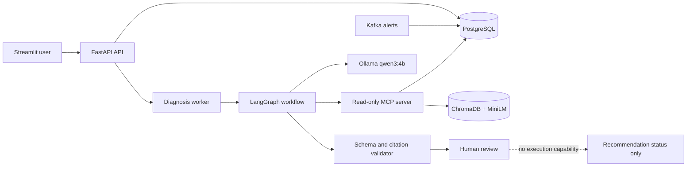

# Architecture and trust boundaries

## Why these boundaries matter

- Ground-truth evaluation labels live only in `evaluation_cases`; the incident API and MCP server never expose them.
- The MCP server contains six allowlisted read-only investigation tools and no shell or mutation tool.
- The local model receives the incident and retrieved evidence, not unrestricted database or filesystem access.
- A Pydantic schema validates every report. A second policy validator rejects nonexistent evidence citations and claims that remediation was executed.
- Human approval changes the review status only. It cannot alter deployments or infrastructure.
- Kafka carries events and lag behavior; queryable historical evidence is persisted in PostgreSQL.

## Deployment modes

| Mode | Purpose | Inference |
|---|---|---|
| Docker Compose | Genuine end-to-end local system | Live, local Ollama |
| GitHub Pages | Permanent zero-cost recruiter link | Recorded, labeled local runs |
| Streamlit Community Cloud | Optional hosted Python replay | Recorded, labeled local runs |

The hosted demo is deliberately honest about replaying locally produced results. Running the complete stack, including a local model and Kafka, on a permanently free hosted service is not a dependable constraint.

